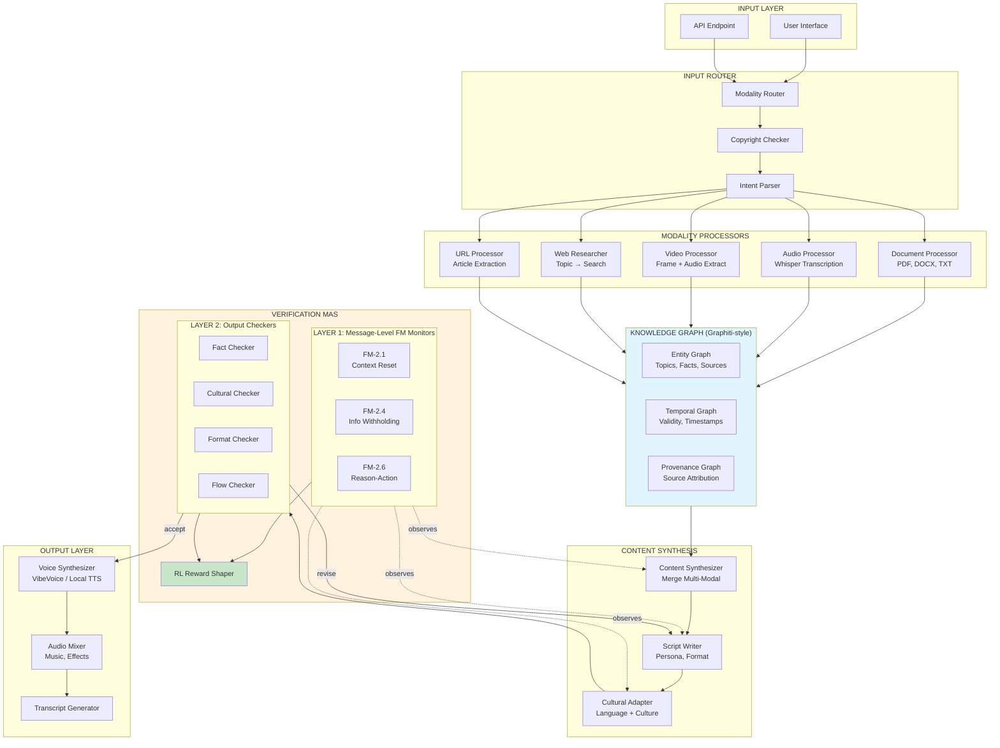

# AI Podcast Generator: Multi-Agent Architecture v2.0

> **Document Status:** Living Document
> **Last Updated:** February 2026
> **Authors:** Revathi Prasad + Claude (Collaborative Design)

---

## Table of Contents

1. [Executive Summary](#1-executive-summary)
2. [Strategic Context](#2-strategic-context)
3. [System Architecture](#3-system-architecture)
4. [Component Specifications](#4-component-specifications)
5. [Knowledge Graph Schema](#5-knowledge-graph-schema)
6. [Handoff Protocol](#6-handoff-protocol)
7. [Verification Architecture](#7-verification-architecture)
8. [RL Integration Points](#8-rl-integration-points)
9. [Research Questions](#9-research-questions)
10. [Community Pain Points Addressed](#10-community-pain-points-addressed)
11. [Technology Stack](#11-technology-stack)
12. [Open Questions](#12-open-questions)
13. [References](#13-references)

---

## 1. Executive Summary

### What We're Building

A **multi-agent podcast generation system** that transforms multi-modal inputs (documents, audio, video, URLs, topics) into culturally-adapted, high-quality podcasts. Unlike existing tools (NotebookLM, etc.), this system:

1. **Preserves information** across agent handoffs using a Knowledge Graph
2. **Verifies quality** at both message-level (for RL training) and output-level (for production)
3. **Supports cultural adaptation** as a first-class feature (Hindi, Tamil, English)
4. **Provides transparency** into fact-checking and source attribution

### Dual Purpose

| Purpose | Goal |
|---------|------|
| **Product** | Deployable podcast generator addressing real user pain points |
| **Research Testbed** | Platform for RL experiments on multi-agent coordination |

### Key Differentiators from NotebookLM

- Multi-modal input handling with copyright awareness
- Cultural adaptation (not just translation)
- Explicit fact-checking with source citation
- Customizable voice personas and formats
- Open architecture for research

---

## 2. Strategic Context

### Why This Project

1. Natural extension of existing ai-builders-podcast codebase
2. Real product surface reveals real research problems
3. Multi-agent + RL intersection is hot research area
4. Cultural adaptation is underexplored and personally meaningful

---

## 3. System Architecture

### 3.1 Architectural Paradigm

**Hybrid: Hierarchical + Collaborative + Sequential**

- **Hierarchical**: Podcast Director (orchestrator) controls overall flow
- **Sequential**: Input → Research → Script → Voice pipeline
- **Collaborative**: Verification agents can debate quality decisions

### 3.2 High-Level Architecture Diagram



### 3.3 Data Flow

```
User Input (multi-modal)
    │
    ▼
┌─────────────────────────────────────────┐
│ INPUT ROUTER                            │
│ • Detect modality types                 │
│ • Flag copyright concerns               │
│ • Parse user intent (length, style)     │
└─────────────────────────────────────────┘
    │
    ▼
┌─────────────────────────────────────────┐
│ MODALITY PROCESSORS (parallel)          │
│ • Each processor writes to Knowledge    │
│   Graph with provenance tags            │
│ • [USER_OWNED] vs [EXTERNAL_COPYRIGHTED]│
└─────────────────────────────────────────┘
    │
    ▼
┌─────────────────────────────────────────┐
│ KNOWLEDGE GRAPH                         │
│ • Entities: Facts, Topics, Sources      │
│ • Edges: supports, contradicts, mentions│
│ • Temporal: created_at, valid_until     │
└─────────────────────────────────────────┘
    │
    ▼
┌─────────────────────────────────────────┐
│ CONTENT SYNTHESIS                       │
│ • Query graph for relevant facts        │
│ • Merge with conflict resolution        │
│ • Generate script with citations        │
└─────────────────────────────────────────┘
    │
    ▼
┌─────────────────────────────────────────┐
│ VERIFICATION (2 layers)                 │
│ Layer 1: FM monitors on every message   │
│ Layer 2: Quality gates on outputs       │
│ Both feed RL Reward Shaper              │
└─────────────────────────────────────────┘
    │
    ▼
┌─────────────────────────────────────────┐
│ OUTPUT GENERATION                       │
│ • Voice synthesis (VibeVoice)           │
│ • Audio mixing                          │
│ • Transcript with citations             │
└─────────────────────────────────────────┘
```

---

## 4. Component Specifications

### 4.1 Input Router

| Attribute | Specification |
|-----------|---------------|
| **Purpose** | Classify inputs, route to appropriate processors |
| **Inputs** | Raw user input (files, URLs, text, audio) |
| **Outputs** | Routing decisions, intent object |
| **Logic** | Rule-based file type detection + LLM for intent parsing |

```python
@dataclass
class RoutingDecision:
    modalities: List[str]  # ["pdf", "audio", "topic"]
    copyright_flags: List[str]  # ["youtube_link_detected"]
    user_intent: UserIntent

@dataclass
class UserIntent:
    length_minutes: int
    audience_level: str  # "beginner", "intermediate", "expert"
    format: str  # "conversation", "interview", "monologue"
    target_language: str
    target_culture: str  # For cultural adaptation
```

### 4.2 Modality Processors

#### Document Processor
- **Tools**: pdfplumber, python-docx, Marker (for complex PDFs)
- **Output**: Structured content with section hierarchy
- **Tags**: All content tagged `[USER_OWNED]`

#### Audio Processor
- **Tools**: Whisper (transcription), speaker diarization
- **Output**: Transcript with speaker labels, timestamps
- **Tags**: User recordings `[USER_OWNED]`, external `[EXTERNAL]`

#### Video Processor
- **Tools**: ffmpeg (audio extraction), frame sampling
- **Output**: Transcript + key frame descriptions
- **Tags**: Based on source (YouTube = `[EXTERNAL_COPYRIGHTED]`)

#### Web Researcher
- **Tools**: Tavily, Brave Search, or similar
- **Output**: Search results with source URLs
- **Tags**: All tagged `[WEB_SOURCE]` with URLs

#### URL Processor
- **Tools**: Trafilatura, newspaper3k
- **Output**: Article text with metadata
- **Tags**: `[EXTERNAL]` with attribution

### 4.3 Content Synthesizer

| Attribute | Specification |
|-----------|---------------|
| **Purpose** | Merge multi-modal content into coherent narrative |
| **Queries** | Knowledge Graph for relevant facts |
| **Conflict Resolution** | When sources disagree, flag for script |
| **Output** | Unified content object with citation map |

### 4.4 Script Writer

| Attribute | Specification |
|-----------|---------------|
| **Purpose** | Generate podcast script with personas |
| **Personas** | Configurable host personalities |
| **Format Support** | Conversation, interview, monologue, debate |
| **Citation Integration** | Scripts include `[cite:fact_id]` markers |

### 4.5 Cultural Adapter

| Attribute | Specification |
|-----------|---------------|
| **Purpose** | Adapt content for target language/culture |
| **NOT Translation** | Cultural context, idioms, references |
| **Languages** | English, Hindi, Tamil (initial) |
| **Output** | Culturally-adapted script |

### 4.6 Voice Synthesizer

| Attribute | Specification |
|-----------|---------------|
| **Primary** | VibeVoice (Microsoft, open-source) |
| **Fallback** | Coqui TTS, Bark |
| **Premium Option** | ElevenLabs API (potential partnership/integration) |
| **Features** | Multiple voices, emotional control, voice cloning |
| **Voice Cloning** | 10-60 seconds reference audio for custom voices |
| **Cost** | VibeVoice: $0 (local) / ElevenLabs: API pricing |

**Voice Cloning Capability:**
```python
# VibeVoice supports zero-shot voice cloning
speaker_config = {
    "host": "path/to/host_reference.wav",  # 10-60s audio
    "guest": None  # Generate voice (no reference)
}
```

**Modular Design:** The voice synthesizer is swappable, allowing:
- Local inference with VibeVoice for cost efficiency
- ElevenLabs API for premium quality
- Custom fine-tuned models for research
- Potential partnership opportunities with TTS providers

---

## 5. Knowledge Graph Schema

### 5.1 Entity Types

```
┌─────────────────────────────────────────────────────────────┐
│ ENTITY TYPES                                                │
├─────────────────────────────────────────────────────────────┤
│ Topic        │ Main subjects discussed                     │
│ Fact         │ Atomic claims with truth value              │
│ Source       │ Origin of information (doc, URL, audio)     │
│ Speaker      │ Voices/personas in the podcast              │
│ Segment      │ Sections of the generated script            │
│ UserIntent   │ What the user wants (length, style, etc.)   │
└─────────────────────────────────────────────────────────────┘
```

### 5.2 Relationship Types

```
┌─────────────────────────────────────────────────────────────┐
│ RELATIONSHIP TYPES                                          │
├─────────────────────────────────────────────────────────────┤
│ MENTIONS     │ (Segment)-[:MENTIONS]->(Topic)              │
│ SUPPORTS     │ (Fact)-[:SUPPORTS]->(Fact)                  │
│ CONTRADICTS  │ (Fact)-[:CONTRADICTS]->(Fact)               │
│ SOURCED_FROM │ (Fact)-[:SOURCED_FROM]->(Source)            │
│ SPOKEN_BY    │ (Segment)-[:SPOKEN_BY]->(Speaker)           │
│ FOLLOWS      │ (Segment)-[:FOLLOWS]->(Segment)             │
└─────────────────────────────────────────────────────────────┘
```

### 5.3 Temporal Properties (Graphiti-style)

Every edge has:
- `t_created`: When this relationship was added to graph
- `t_valid`: When this fact became true
- `t_invalid`: When this fact stopped being true (null if still valid)
- `confidence`: Float 0-1

### 5.4 Example Graph Structure

```
(Topic: AI_Safety)
    │
    ├──[:ABOUT]──(Fact: "Anthropic founded 2021")
    │               │
    │               └──[:SOURCED_FROM]──(Source: wikipedia_url)
    │
    ├──[:ABOUT]──(Fact: "Claude is an AI assistant")
    │               │
    │               ├──[:SOURCED_FROM]──(Source: user_doc.pdf)
    │               └──[:SUPPORTS]──(Fact: "Anthropic makes Claude")
    │
    └──[:MENTIONED_IN]──(Segment: "intro_paragraph")
                            │
                            └──[:SPOKEN_BY]──(Speaker: "Host_A")
```

---

## 6. Handoff Protocol

### 6.1 The Problem

Without explicit handoffs, agents lose context (FM-2.1, FM-2.4). But full context = token explosion.

### 6.2 Lightweight Handoff Design

```python
@dataclass
class LightweightHandoff:
    """Explicit handoff between agents without token bloat."""

    # What was done
    summary: str  # 100-200 tokens max

    # Confidence and quality signals
    confidence: float  # 0-1
    completeness: float  # 0-1

    # Graph references (not full content)
    relevant_entities: List[str]  # ["fact_123", "topic_456"]
    known_gaps: List[str]  # ["gap_entity_001"]

    # Flags for downstream
    flags: List[str]  # ["needs_fact_check", "contains_controversy"]

    # What's expected next
    requires_from_next: List[str]  # ["verify_facts", "add_examples"]

    # Pointer to full context (for retrieval if needed)
    full_context_ref: str  # Graph query or cache key

    # Metadata for observability
    source_agent: str
    timestamp: datetime
    trace_id: str  # For LangSmith/Langfuse tracking
```

### 6.3 How Receiving Agents Use It

```python
def process_handoff(handoff: LightweightHandoff):
    # 1. Check confidence - do we need to query graph for more?
    if handoff.confidence < 0.7:
        full_context = query_graph(handoff.full_context_ref)

    # 2. Check known gaps - can we fill them?
    for gap in handoff.known_gaps:
        if can_address(gap):
            # Try to fill the gap
            pass

    # 3. Check flags - adjust behavior accordingly
    if "needs_fact_check" in handoff.flags:
        enable_strict_verification()

    # 4. Get relevant entities from graph
    entities = get_entities(handoff.relevant_entities)

    # 5. Do the work
    result = do_agent_work(entities, handoff.requires_from_next)

    # 6. Create handoff for next agent
    return create_handoff(result)
```

---

## 7. Verification Architecture

### 7.1 Two-Layer Design

```
┌─────────────────────────────────────────────────────────────┐
│ LAYER 1: MESSAGE-LEVEL FM MONITORS                          │
│ (Real-time, observes every inter-agent message)             │
│                                                             │
│ Purpose: Dense RL training signals                          │
│ When: During execution                                      │
│ Output: Step-level reward/penalty signals                   │
├─────────────────────────────────────────────────────────────┤
│ FM-2.1 Monitor: Context Reset Detection                     │
│   - Checks: Did handoff preserve critical context?          │
│   - Signal: -1 if context lost, 0 otherwise                 │
│                                                             │
│ FM-2.4 Monitor: Information Withholding Detection           │
│   - Checks: Did agent share all relevant info?              │
│   - Signal: -1 if info withheld, 0 otherwise                │
│                                                             │
│ FM-2.6 Monitor: Reasoning-Action Alignment                  │
│   - Checks: Does action match stated reasoning?             │
│   - Signal: -1 if mismatch, 0 otherwise                     │
│                                                             │
│ FM-2.3 Monitor: Task Derailment Detection                   │
│   - Checks: Is agent still on task?                         │
│   - Signal: -1 if derailed, 0 otherwise                     │
└─────────────────────────────────────────────────────────────┘
                              │
                              ▼
┌─────────────────────────────────────────────────────────────┐
│ LAYER 2: OUTPUT-LEVEL QUALITY CHECKERS                      │
│ (After generation, before final output)                     │
│                                                             │
│ Purpose: Production quality gates                           │
│ When: At stage boundaries                                   │
│ Output: Accept / Reject / Revise decisions                  │
├─────────────────────────────────────────────────────────────┤
│ Fact Checker                                                │
│   - Input: Script + Source graph                            │
│   - Checks: Are claims supported by sources?                │
│   - Output: {verified: [...], unverified: [...]}            │
│                                                             │
│ Cultural Checker                                            │
│   - Input: Script + Target culture                          │
│   - Checks: Idioms, references, sensitivity                 │
│   - Output: {flags: [...], suggestions: [...]}              │
│                                                             │
│ Format Checker                                              │
│   - Input: Script + User constraints                        │
│   - Checks: Length, vocabulary, structure                   │
│   - Output: {compliant: bool, violations: [...]}            │
│                                                             │
│ Flow Checker                                                │
│   - Input: Script                                           │
│   - Checks: Conversation naturalness, transitions           │
│   - Output: {flow_score: float, choppy_sections: [...]}     │
└─────────────────────────────────────────────────────────────┘
                              │
                              ▼
┌─────────────────────────────────────────────────────────────┐
│ RL REWARD SHAPER                                            │
│                                                             │
│ Aggregates signals from both layers:                        │
│ - Layer 1: Step-level penalties (dense)                     │
│ - Layer 2: Quality scores (sparse but informative)          │
│                                                             │
│ Output: Shaped reward for policy gradient training          │
└─────────────────────────────────────────────────────────────┘
```

### 7.2 Verification Queries Against Knowledge Graph

```cypher
-- Fact Checker: Find unsupported claims
MATCH (s:Segment)-[:CONTAINS]->(f:Fact)
WHERE NOT (f)-[:SOURCED_FROM]->(:Source)
RETURN s.id, f.claim AS unsupported_claim

-- Fact Checker: Find contradictions
MATCH (f1:Fact)-[:CONTRADICTS]->(f2:Fact)
WHERE f1.in_script = true AND f2.in_script = true
RETURN f1.claim, f2.claim, "contradiction" AS issue

-- Flow Checker: Find abrupt topic transitions
MATCH (s1:Segment)-[:FOLLOWS]->(s2:Segment)
MATCH (s1)-[:MENTIONS]->(t1:Topic)
MATCH (s2)-[:MENTIONS]->(t2:Topic)
WHERE t1 <> t2 AND NOT (t1)-[:RELATED_TO]->(t2)
RETURN s1.id, s2.id, "abrupt_transition" AS issue
```

---

## 8. RL Integration Points

### 8.0 Two-Level RL Architecture

The system supports reinforcement learning at two complementary levels:

```
┌─────────────────────────────────────────────────────────────┐
│  LEVEL 1: Multi-Agent Coordination RL                       │
│  ─────────────────────────────────────────────────────────  │
│  What: Planner decisions, verification thresholds           │
│  Reward: Fact accuracy, cultural appropriateness, user sat  │
│  Outcome: Better content, fewer failures, smarter routing   │
│  Timeline: Immediate focus                                  │
└─────────────────────────────────────────────────────────────┘
                              │
                              ▼
┌─────────────────────────────────────────────────────────────┐
│  LEVEL 2: Voice Generation RL                               │
│  ─────────────────────────────────────────────────────────  │
│  What: Prosody, pacing, emotional expression, cloning       │
│  Reward: Naturalness MOS, listener engagement, preferences  │
│  Outcome: Podcast-optimized voices, format-specific prosody │
│  Timeline: Future research direction                        │
└─────────────────────────────────────────────────────────────┘
```

**Why Two Levels Matter:**
- Level 1 optimizes *what* is said (content quality)
- Level 2 optimizes *how* it sounds (audio quality)
- Together, they create a compounding improvement loop
- Static systems (ElevenLabs, NotebookLM) cannot match this over time

### 8.1 Where Training Signals Come From

| Signal Source | Type | Granularity | Use Case |
|---------------|------|-------------|----------|
| FM-2.1 Monitor | Penalty | Per-message | Credit assignment for context loss |
| FM-2.4 Monitor | Penalty | Per-message | Credit assignment for info withholding |
| FM-2.6 Monitor | Penalty | Per-message | Credit assignment for action errors |
| Fact Checker | Score | Per-output | Trajectory-level accuracy signal |
| Cultural Checker | Score | Per-output | Trajectory-level appropriateness |
| User Feedback | Reward | Per-episode | Ground truth quality signal |

### 8.2 Flow-GRPO Adaptation (from AgentFlow)

The AgentFlow paper's Flow-GRPO algorithm can be adapted:

1. **Final-outcome reward broadcast**: User rating + checker scores → every turn
2. **Step-level modulation**: FM monitor penalties reduce turn-level rewards
3. **Token-level clipped objective**: PPO-style updates with KL penalty
4. **Group-normalized advantages**: Batch trajectories for stable updates

### 8.3 What Gets Trained vs Frozen

| Component | Training Status | Rationale |
|-----------|-----------------|-----------|
| Input Router | Frozen | Deterministic routing |
| Modality Processors | Frozen | Use best-in-class tools |
| **Planner/Orchestrator** | **TRAINED** | Core decision-making |
| Script Writer | Frozen (prompted) | Large LLM, expensive to fine-tune |
| Cultural Adapter | Frozen (prompted) | Domain expertise via prompting |
| **Verifier (Layer 2)** | **TRAINED** | Learn quality thresholds |
| Voice Synthesizer | Frozen | External tool |

---

## 9. Research Questions

### 9.1 Multi-Agent Coordination

| RQ# | Question | Experiment Design |
|-----|----------|-------------------|
| RQ1 | Does explicit handoff protocol reduce FM-2.1/FM-2.4 failures? | A/B test: implicit vs explicit handoffs, measure context preservation |
| RQ2 | Does Knowledge Graph memory outperform linear context? | Compare: graph retrieval vs full context passing, measure accuracy + tokens |
| RQ3 | What's the optimal verification layer granularity? | Vary checker frequency (every message vs every output), measure quality/cost |

### 9.2 RL Training

| RQ# | Question | Experiment Design |
|-----|----------|-------------------|
| RQ4 | Does Layer 1 FM monitoring improve credit assignment? | Compare: sparse rewards only vs FM-augmented rewards, measure learning speed |
| RQ5 | Can we train the Planner without training downstream agents? | Freeze all except Planner, measure end-to-end quality improvement |
| RQ6 | What reward shaping best balances accuracy vs engagement? | Vary weights on fact-check vs flow scores, measure user preference |

### 9.3 Cultural Adaptation (Novel Angle)

| RQ# | Question | Experiment Design |
|-----|----------|-------------------|
| RQ7 | Can multi-agent debate improve cultural sensitivity? | Compare: single adapter vs adapter + cultural reviewer debate |
| RQ8 | What cultural markers transfer across languages? | Analyze which adaptations generalize vs require language-specific tuning |
| RQ9 | Does cultural adaptation improve engagement for target audience? | User study: adapted vs literal translation, measure comprehension + preference |

### 9.4 Information Preservation

| RQ# | Question | Experiment Design |
|-----|----------|-------------------|
| RQ10 | What graph schema best preserves multi-modal provenance? | Compare schemas on retrieval accuracy + storage efficiency |
| RQ11 | Does temporal awareness improve fact-checking? | Compare: static graph vs Graphiti-style temporal graph on outdated fact detection |

---

## 10. Community Pain Points Addressed

### 10.1 NotebookLM Complaints → Our Solutions

| Pain Point | NotebookLM Issue | Our Solution |
|------------|------------------|--------------|
| **Limited Voices** | Only 2 voices, no customization | Multiple voice personas via VibeVoice, emotional control |
| **Script Opacity** | No visibility into script before audio | Script review/edit stage before synthesis |
| **Single Version** | Can't keep multiple versions | Knowledge Graph preserves all versions, easy regeneration |
| **No Transcripts** | Transcripts not provided | Transcript generator with citation markers |
| **Hallucinations** | 54% of errors from sources repeated | Fact Checker agent with source verification |
| **Audio Glitches** | Random speaker switches | Explicit speaker assignment in script structure |
| **English Only** | No multi-language support | Cultural Adapter for Hindi, Tamil, English |
| **Length Unpredictable** | Output length varies wildly | Format Checker enforces user-specified length |
| **Sensitive Topics** | Banter inappropriate for serious content | Format detection adjusts tone automatically |

### 10.2 Broader AI Podcast Complaints → Our Solutions

| Pain Point | Industry Issue | Our Solution |
|------------|----------------|--------------|
| **Hallucinations** | Confident false information | Two-layer verification + source citation |
| **Lack of Authenticity** | Robotic, same rhythm | Multiple personas + flow checker for naturalness |
| **No Fact-Checking** | Errors pass through | Explicit Fact Checker against Knowledge Graph |
| **Content Safety** | Bias amplification | Cultural Checker + sensitivity detection |
| **No Customization** | One-size-fits-all | Configurable length, format, style, audience level |

---

## 11. Technology Stack

### 11.1 Core Framework

| Component | Technology | Rationale |
|-----------|------------|-----------|
| Agent Framework | **LangGraph** | Production-ready, familiar, good observability |
| Observability | **LangSmith** (free tier) or **Langfuse** (open-source) | Tracing, debugging, evaluation |
| Knowledge Graph | **Neo4j** or **Kuzu** (embedded) | Graphiti compatibility, Cypher queries |
| LLM | **Claude** (primary), **Llama** (local fallback) | Quality + cost balance |
| TTS | **VibeVoice** (primary), **Coqui** (fallback) | Open-source, $0 cost |

### 11.2 Supporting Tools

> **Note:** See [TOOL_ANALYSIS.md](./TOOL_ANALYSIS.md) for detailed benchmarks and rationale.

| Purpose | Primary | Fallback/Alternative | License |
|---------|---------|---------------------|---------|
| PDF Processing | pymupdf4llm | marker-pdf (complex), pdfplumber (tables) | AGPL/GPL/MIT |
| Audio Transcription | faster-whisper | WhisperX (diarization) | MIT/BSD |
| Web Search | Serper | Tavily (RAG), DuckDuckGo (free) | API/MIT |
| Article Extraction | Trafilatura | Fundus (news), readability-lxml | Apache-2.0 |
| Audio Processing | ffmpeg-python | librosa (analysis), soundfile (I/O) | LGPL/ISC/BSD |
| Knowledge Graph | Kuzu | Neo4j (scale) | MIT/GPL |

**Key Changes from Initial List:**
- Replaced generic "Whisper" with **faster-whisper** (4x faster, MIT license)
- Added **Kuzu** as primary graph DB (18x faster than Neo4j, embedded)
- Removed **pydub** (unmaintained, memory issues) → use ffmpeg-python
- Added **Serper** as primary search (faster, more free credits than Tavily)
- Specified **pymupdf4llm** over generic pdfplumber (better LLM output)

### 11.3 Development Environment

- Python 3.10+
- LangGraph 1.0+
- Neo4j 5.x or Kuzu
- CUDA (optional, for local LLM/TTS)

---

## 12. Open Questions

> **See [OPEN_QUESTIONS.md](./OPEN_QUESTIONS.md)** for the full living document tracking all questions, decisions, and their evolution.

**Resolved:** Graph DB (Kuzu), FM Monitor LLM (Qwen3 8B), Verification (Adaptive), TTS (VibeVoice), Metrics (Multi-tier), Cost (Tiered)

**Active:** User feedback collection, baseline definition, dataset approach, MVP scope, UI framework

---

## 13. References

### Papers

- [AgentFlow: In-the-Flow Agentic System Optimization](https://arxiv.org/abs/2510.05592) - Stanford, Flow-GRPO algorithm
- [AgentFly: Extensible RL for LM Agents](https://arxiv.org/abs/2507.14897) - RL training framework
- [MAST: Multi-Agent System Failure Taxonomy](https://arxiv.org/abs/2503.13657) - Failure mode analysis
- [Zep: Temporal Knowledge Graph for Agent Memory](https://arxiv.org/abs/2501.13956) - Graphiti architecture
- [A-MEM: Agentic Memory for LLM Agents](https://arxiv.org/abs/2502.12110) - Memory systems

### Frameworks & Tools

- [LangGraph Documentation](https://docs.langchain.com/oss/python/langchain/multi-agent)
- [LangSmith Observability](https://www.langchain.com/langsmith/observability)
- [Langfuse (Open-Source Alternative)](https://langfuse.com/)
- [Graphiti GitHub](https://github.com/getzep/graphiti)
- [VibeVoice (Microsoft)](https://github.com/microsoft/VibeVoice)

### Community Research

- NotebookLM limitations: Multiple Reddit threads, XDA articles
- Washington Post AI podcast issues: NPR, Semafor coverage
- AI podcast generator comparisons: OreateAI, BeFreeAI reviews

---

## Appendix A: Migration Path from Current Codebase

| Current File | Maps To | Changes Needed |
|--------------|---------|----------------|
| `orchestrator.py` | Podcast Director + LangGraph StateGraph | Rewrite as graph-based orchestrator |
| `research_engine.py` | Web Researcher processor | Extract as standalone agent |
| `personality_engine.py` | Script Writer agent | Refactor for explicit handoffs |
| `transformation.py` | Cultural Adapter agent | Add cultural (not just language) logic |
| `audio_pipeline.py` | Voice Synthesizer | Replace ElevenLabs with VibeVoice |
| `cache.py` | Knowledge Graph | Migrate to graph-based storage |
| `models.py` | Graph entity schemas | Extend for new entity types |

---

*Document generated collaboratively. This is a living document - update as decisions evolve.*
